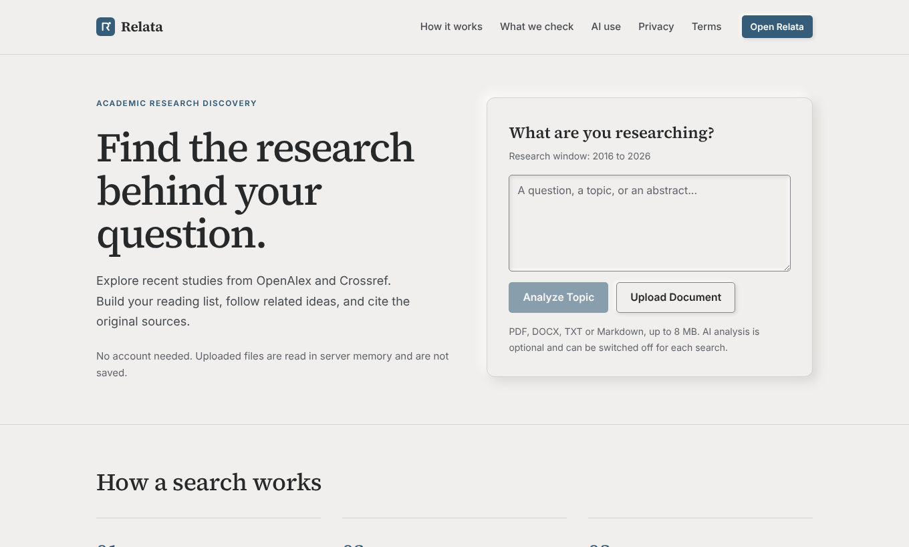
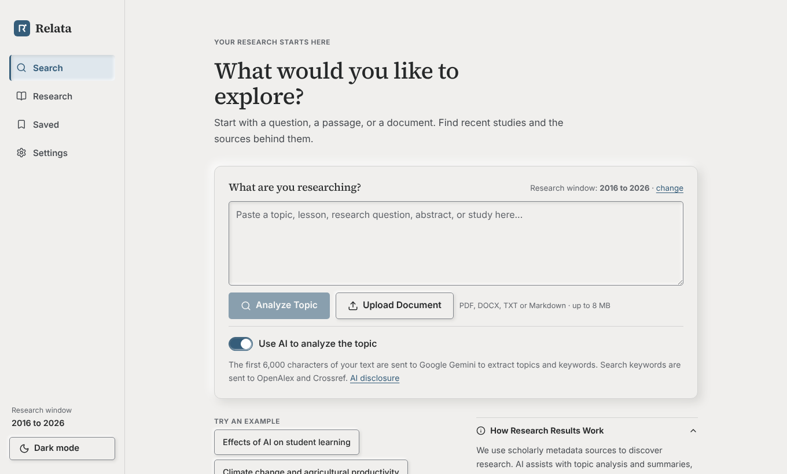
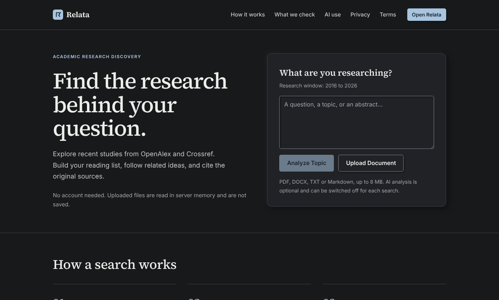

# Relata

**Find recent, verifiable studies on your topic.**

Relata is a research discovery tool for students and researchers. Paste a topic, a question or an abstract, or upload a PDF, DOCX, TXT or Markdown file. Relata searches OpenAlex and Crossref and lists studies with their authors, year, journal and a DOI link, plus related concepts and the search steps behind them.



## Status

Relata is pre-launch. It has been tested with stubbed and fixture data, not against live OpenAlex, Crossref or AI services. Before relying on the results, run it with real keys and check a few topics you know well. The Privacy, Terms and Cookie pages are draft text and need a legal review before a public launch. See [Deploying](#deploying).

## What it does

- Searches OpenAlex (the main source) and Crossref, merges duplicates and lists each study with a link to its source record.
- Checks DOIs against Crossref and marks each one "Verified DOI", "DOI not found in Crossref" or "DOI unchecked". When the two sources disagree, it says so and shows both values.
- Filters by publication window (1, 3, 5 or 10 years by default, older ranges clearly labelled), study type, open access and source.
- Saves studies, topics and searches in the browser, with collections. No account is needed.
- Copies citations in APA 7, MLA 9 or Chicago 17, and exports results as .txt, .csv or .json.
- Reads uploaded documents in server memory and discards them. Nothing is written to disk.
- Works without AI. If no AI key is set, or the AI service fails, search, verification, filters, saving and citations all still work.
- Light and dark themes, keyboard navigation, and a layout that works on phones.

## How results are kept honest

- Every study comes from an OpenAlex or Crossref record. AI never supplies studies and never changes authors, dates, DOIs or links.
- A study with no valid publication date is excluded. A study with no DOI or landing page shows "Source link unavailable" instead of a guessed link.
- Relata does not score studies for quality, and it does not call work peer-reviewed, because the source data does not say so reliably.
- If the scholarly sources cannot be reached, Relata says so and shows no results.
- Results are relevant studies found through the available sources, not a complete list of everything written on a topic.

### Where AI is used

AI (Google Gemini or OpenAI, your choice) is optional and labelled wherever it appears. It finds the main topic, expands keywords, writes short definitions, suggests related topics, and writes short relevance notes on studies that were already retrieved. Any statement containing a link, DOI or number that is not in the source record is discarded. Only the opening part of your text is sent, and only when AI is switched on for that search.

## Screenshots

| Search page | Dark theme |
|---|---|
|  |  |

## Quick start

You need Node.js 20 or newer.

```bash
npm install
cp .env.example .env     # optional: add API keys (they stay on the server)
npm run dev              # API on :8787 and the Vite dev server on :5173
```

Open http://localhost:5173. For a production build:

```bash
npm run build
npm start                # serves the API and the built app on :8787
```

Without any keys, Relata still runs. Adding a free OpenAlex key is strongly recommended, because the shared keyless budget is small.

## Configuration

Everything is set through environment variables, read on the server only. Keys are never sent to the browser or stored in local storage. See `.env.example` for the full list.

| Variable | Purpose | Default |
|---|---|---|
| `OPENALEX_API_KEY` | Larger OpenAlex budget (free key) | none |
| `GEMINI_API_KEY`, `OPENAI_API_KEY` | Turn on AI features. Either one, or both | none |
| `PRIMARY_AI_PROVIDER` | Which provider to try first: `gemini` or `openai` | `gemini` |
| `CONTACT_EMAIL` | Shown on the Contact page and policies, sent to Crossref | none |
| `PUBLIC_URL` | Public address, for the sitemap, canonical links and share image | none |
| `PORT` | Server port | `8787` |
| `TRUST_PROXY` | Set to `true` behind a reverse proxy, so rate limits see real visitor IPs | `false` |
| `MAX_UPLOAD_MB` | Largest upload | `8` |
| `MAX_INPUT_CHARS` | Longest pasted text | `20000` |
| `AI_MAX_INPUT_CHARS` | Most text ever sent to an AI provider | `6000` |
| `RATE_LIMIT_SEARCH`, `RATE_LIMIT_AI`, `RATE_LIMIT_UPLOAD`, `RATE_LIMIT_GENERAL` | Requests per minute per IP | `40`, `20`, `8`, `240` |

## Deploying

Relata is one Node process: it serves the API and the built front end. Any host that runs `npm run build` and `npm start` on Node 20 or newer will do. Before you go public:

1. **Set `CONTACT_EMAIL`** to an address you monitor. Without it the Contact page says none is set.
2. **Set `PUBLIC_URL`** to your final address, for example `https://relata.example`. Without it there is no sitemap, canonical link or share image.
3. **Turn on HTTPS first.** The server sends a Strict-Transport-Security header that includes subdomains, which browsers remember for a year. Make sure every subdomain of your domain supports HTTPS before you deploy.
4. **Set `TRUST_PROXY=true`** if your host puts a proxy in front of Relata. Otherwise all visitors share one IP address and one rate limit.
5. **Set a spending limit or alert** on any AI account whose key you use.
6. **Have the policy pages reviewed**, then remove the "draft" banner (the `draft` flag on each page in `src/pages/InfoPages.tsx`).
7. **Run it with real keys** and check several real topics and a real upload before you announce it.

The site also serves `/robots.txt`, which hides the tool and the API from search engines, and a real HTTP 404 for unknown addresses.

### Vercel

Deploy the repository root. `vercel.json` builds the frontend and packages the existing Express app as one Node function through `api/handler.ts`. API requests and page navigation go to Express, preserving redirects, metadata and real 404s; built assets are served directly by Vercel. The standalone `npm start` command is for other Node hosts.

In the Vercel project's environment settings, set `PUBLIC_URL` to your production address, `CONTACT_EMAIL`, and your provider keys as needed. Set `MAX_UPLOAD_MB=4`: Vercel's function request limit is 4.5 MB, including multipart overhead. Enable Fluid compute so the configured 120-second function duration is supported. Visitor IPs are trusted through Vercel's gateway by the function entry point.

Deploy a new build containing this configuration. Redeploying an older commit will keep the old routing. After deployment, `/api/health` must return JSON with `"status":"ok"`; then try a search, a small document upload and a direct visit to `/app/research`.

Caches, rate limits and the verified-study store are held in each function instance's memory. They reset on cold starts and are not shared across instances; an AI summary request may need a fresh search if its studies are unavailable in that instance. For shared limits and state across instances, use a shared store before scaling up.

## Tests

```bash
npm test                 # unit and pipeline tests, stubbed upstreams, no network needed
npm run typecheck
```

Browser tests drive a real browser against a fixture server and are described in [docs/DEVELOPMENT.md](docs/DEVELOPMENT.md). The fixture server is a local QA tool only. It serves clearly labelled "[Fixture]" studies and is never started by `npm start`.

## Project structure

```text
shared/    types, research window, filter capabilities, citation formatting, routes
server/    Express API: research/ (OpenAlex, Crossref, dedupe, reconcile),
           ai/ (providers, schemas, guards), documents/ (file extraction), middleware/
src/       React 19 and TypeScript app: pages/, components/, state/, styles/
public/    favicon and share image
tests/     unit and pipeline tests, plus e2e/ (Playwright, Python) and harness/
docs/      development notes and README screenshots
```

Built with Express 5, React 19, Vite and TypeScript. There is no database. Searches are cached in memory only, so restarting the server clears the caches and nothing else.

## Pages

| Address | Page |
|---|---|
| `/` | Landing page with a working search box |
| `/app` | Search: paste text or upload a file |
| `/app/research`, `/app/saved`, `/app/settings` | Results, saved library, settings |
| `/about`, `/contact`, `/privacy`, `/terms`, `/cookies`, `/disclaimer`, `/ai-use` | Information and policy pages |

## Design rules

Relata is meant to look like a finished product, not a template. These rules apply to everything added to the site:

- Every button-style control uses one corner radius, `--r-btn` (5px) in `src/styles/tokens.css`.
- No gradients, pill-shaped buttons, emoji icons, fake reviews, fake metrics or customer counters.
- No em or en dashes in visible text.
- No scroll-triggered or cursor-following animation.
- No generated photos. Use real screenshots.
- Copy says what the product does, and nothing it does not do.

## Privacy in short

No accounts, analytics, advertising trackers or cookies. Settings, saved studies and searches stay in your own browser and can be cleared from Settings. Uploaded documents are read in server memory and discarded. The full text is on the Privacy page in the app.

## Known limits

- Scanned PDFs are not supported, because there is no OCR.
- A search checks up to 100 records per source and query and shows up to 100 eligible studies. The results page says so when that limit applies. Refine your keywords to go further.
- Caches are in memory, so each server instance has its own.
- Share previews show the same title and description on every page.
- Browser tests run in Chromium only.

## Planned

Sign-in is planned but not built. The code has places ready for it (`src/state/auth.tsx`, `src/components/AccountSlot.tsx`, `server/auth/context.ts`), and [docs/DEVELOPMENT.md](docs/DEVELOPMENT.md) lists the steps. The Privacy and Terms pages say there are no accounts and must be updated when sign-in is added.

## Data sources

Bibliographic metadata comes from [OpenAlex](https://openalex.org) (CC0) and [Crossref](https://www.crossref.org). Relata is not affiliated with or endorsed by either, or by any AI provider it can use.

## Changelog

See [CHANGELOG.md](CHANGELOG.md).

## License

No license file is included yet. Add one (for example MIT or Apache-2.0) before you accept contributions or let others reuse the code.
